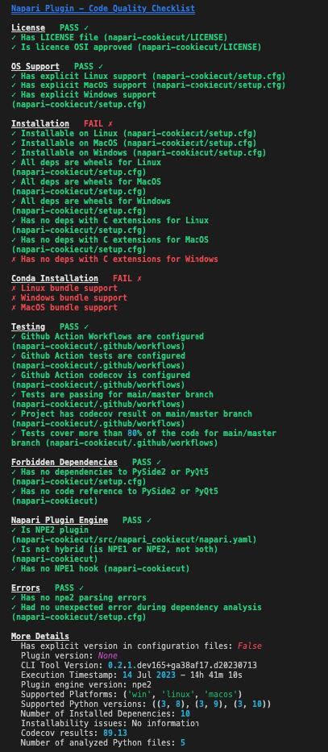
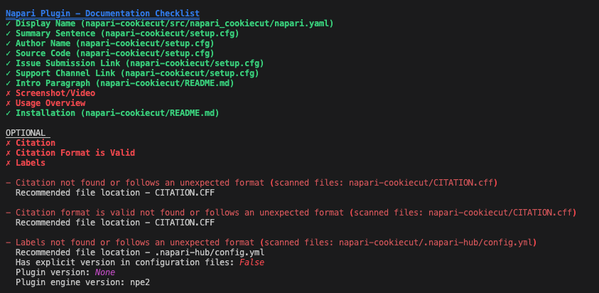

# napari-hub-cli

Command line utilities for inspecting and validating plugins for the napari hub.

**NOTE:** the project is still under developement and this version is not yet deployed in Pypi.

## Supported operating systems

The tool works on Linux and MacOS without issue. On Windows, the tool works without issue in the Windows Subsystem for Linux (WSL) but there is a known issue in Windows without WSL - the result from the plugin installation check is flaky. See [this issue](https://github.com/chanzuckerberg/napari-hub-cli/issues/135) for more details.

To set up WSL, follow the instructions [here](https://learn.microsoft.com/en-us/windows/wsl/install). With WSL set up, you can run the tool from the WSL terminal following the instructions below.

## Installation

First the repository needs to be cloned

```sh
git clone https://github.com/chanzuckerberg/napari-hub-cli.git
cd napari-hub-cli
```

As any python program, it is recommended to create a virtual env.
You probably have your own and prefered method, here is a classical one using the `venv` module:

```sh
# inside the "napari-hub-cli" folder, where you cloned the repository
python -m venv --symlinks .venv
source .venv/bin/activate  # activating the virtual env
```

Once you activated the virtual env, you can install all the required dependencies and the tool this way using `pip`:

```sh
python -m pip install napari-hub-cli
```

Alternatively, you can also install the napari hub CLI directly from the cloned repository:

```sh
# inside the "napari-hub-cli" folder, where you cloned the repository
# and with virtual env activated
python -m pip install -e .
```

To check that the installation went well, this command prints the help menu

```sh
napari-hub-cli --help
```

## Usage

### Code quality checklist

The command used to create the Code quality checklist is

```bash
 napari-hub-cli check-quality /tmp/example-plugin
```

The intent of this utility is to check your plugin for code quality metrics listed described [in the wiki](https://github.com/chanzuckerberg/napari-hub-cli/wiki/Plugin-quality-checklist-sources).
The checklist comes in two parts, first, a freeform metadata section, and second, a list of metrics that are checked as True/False.

Example output:



### Documentation checklist

The command used to create the Documentation checklist is

```bash
 napari-hub-cli check-metadata /tmp/example-plugin
```

The intent of this utility is to check your plugin for specific metadata in the [napari-Hub recommended file locations](https://github.com/chanzuckerberg/napari-hub/wiki/Customizing-your-plugin's-listing).
With this, it creates a Documentation checklist identifying if a plugin has the metadata listed [in the wiki](https://github.com/chanzuckerberg/napari-hub-cli/wiki/Plugin-metadata-checklist-sources).

Example output:



### Citation

To create a citation file (`CITATION.CFF`) for your plugin run

```bash
 napari-hub-cli create-citation /tmp/example-plugin
```

This utility works by looking into:

- GitHub Repository metadata
- `README.md`

and creating a `CITATION.CFF`, a plain text file with human- and machine-readable citation information for software and datasets.

For citations to be parsed from the `README.md` these need to have either the **APA**(American Psychological Association) style or **BibTex** style format.

The `CITATION.CFF` file naming needs to be as it is, otherwise GitHub won't recognize it as a citation file.

The format for the CITATION.CFF is the following:

- The first citation that appears references the software
- The preffered citation, the one used in GitHub, references an article/publisher, preferring an article citation when both exist
- when both article and publisher information exist, publisher information is written as a sub-reference

#### Citation references

Below you can find some examples of how to use the `CITATION.CFF`.

Referencing other work:

```yaml
cff-version: 1.2.0
authors:
  - family-names: Druskat
    given-names: Stephan
message: "If you use this software, please cite it using these metadata."
references:
  - authors:
      - family-names: Spaaks
        given-names: "Jurriaan H."
    title: "The foundation of Research Software"
    type: software
  - authors:
      - family-names: Haines
        given-names: Robert
    title: "Ruby CFF Library"
    type: software
    version: 1.0
title: "My Research Software"
```

Credit Redirection:

```yaml
cff-version: 1.2.0
authors:
  - family-names: Druskat
    given-names: Stephan
message: "If you use this software, please cite both the article from preferred-citation and the software itself."
preferred-citation:
  authors:
    - family-names: Druskat
      given-names: Stephan
  title: "Software paper about My Research Software"
  type: article
title: "My Research Software"
```

Some more information regarding `.CFF` can be found [here](https://docs.github.com/en/repositories/managing-your-repositorys-settings-and-features/customizing-your-repository/about-citation-files).

## Previewing your plugin's napari hub page

To view a preview of your plugin listing for the napari hub, we recommend using the [napari hub preview page service](https://github.com/chanzuckerberg/napari-hub/blob/main/docs/setting-up-preview.md).

## Code of Conduct

This project adheres to the Contributor Covenant [code of conduct](https://github.com/chanzuckerberg/.github/blob/master/CODE_OF_CONDUCT.md). By participating, you are expected to uphold this code. Please report unacceptable behavior to [opensource@chanzuckerberg.com](mailto:opensource@chanzuckerberg.com).
