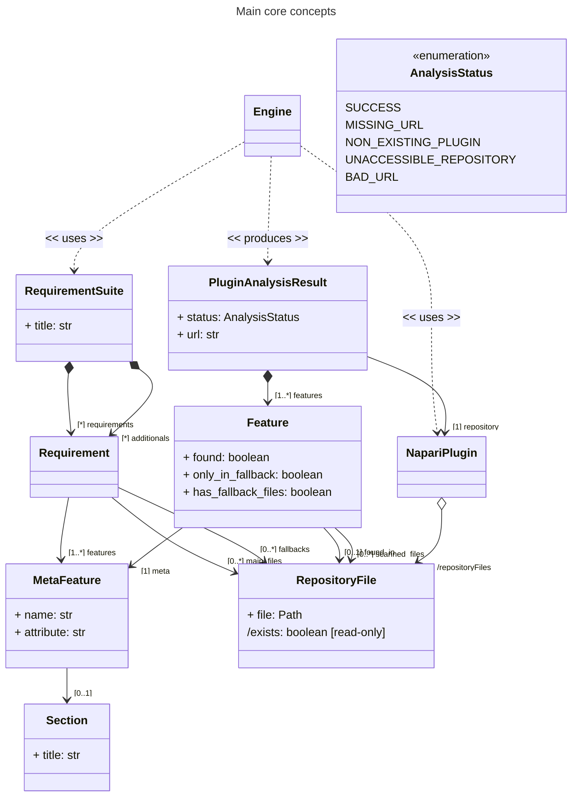
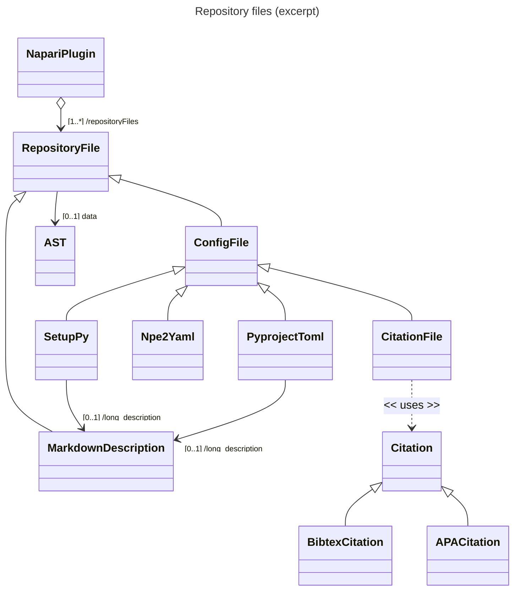
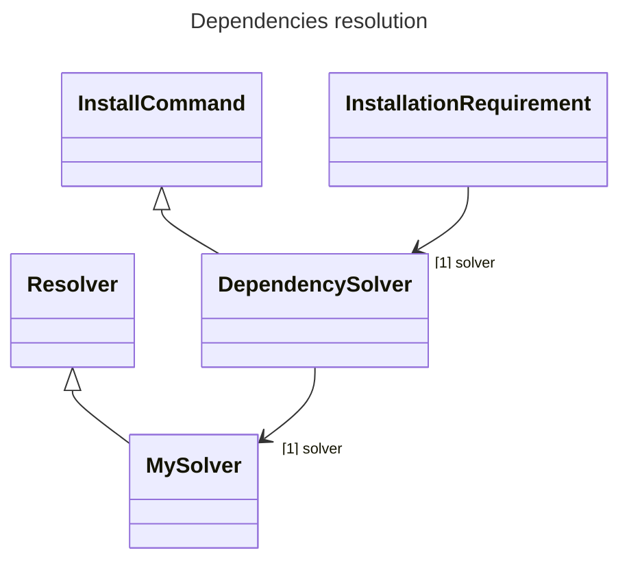
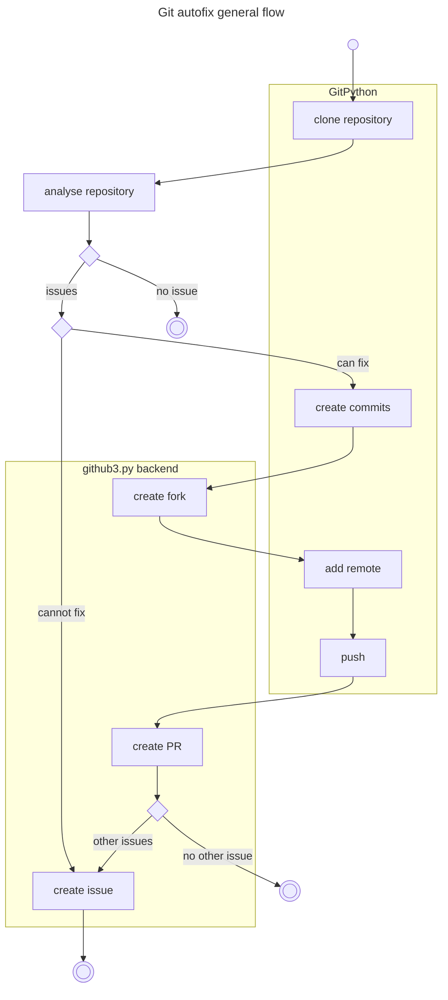

# `napari-hub-cli` architecture

This document gives internal details about the architecture of the `napari-hub-cli` tool, how the different packages works together, the used libraries for the most important features and the different important classes from the tool.

## General overview and idea

The `napari-hub-cli` tool enables users and power users (users with some special rights) to audit their Napari plugin locally, _i.e_ from a cloned repository, or using the name of a plugin registered in the Napari HUB platform.
The tool proposes basically two kind of analysis: one related to the verification of the plugin metadata, while the second is related to some code quality analysis.
Each of the analysis defines a set of rules/requirements that describe the different points that needs to be checked during the analysis.
When an analysis is ran, the result of each requirement is saved, then displayed in a formatted way, either in the screen or in a CSV file, depending on the options that have been passed to the tool.


### Plugin repository representation, Requirements representation and requirements suite

The core of the tool revolve around 4 abstractions:

1. the Napari plugin repository: `NapariPlugin`
2. the requirement: `Requirement`, representing a rule that needs to be check
3. the requirement suite: `RequirementSuite`, representing a set of requirements, thus a special kind of analysis
4. the requirement suite result: `PluginAnalysisResult` which holds the results of the analysis.

The following diagram shows how those abstractions are connected and some more details about the concepts that are involved during the execution of the engine.


The `Engine` is here an abstract concept, not really implemented, that just represents the fact that it takes as input a `NapariPlugin` instance, a `RequirementSuite` instance and produces a `PluginAnalysisResult`, which represents the results of the application of the cheklist to the plugin.
The `RequirementSuite` is identified by a title, and contains two disting lists of rules `Requirement`.
The relationship `requirements` holds `Requirement` instances that needs to return `True` or `False` only as results.
The relationship `additionnals` holds `Requirement` instances that returns additional information in the form of a string.
Depending the relationship that holds the instance, the result will be displayed in a section in the screen or in the CSV.
Each `Requirement` is built around a `MetaFeature`, which represents "how" the information will be checked.
The `MetaFeature` has a name to identify it, and a section (not mandatory).
Finally, each `Requirement` has references to `RepositoryFile` instances, which are an abstraction over the files of a plugin repository (this will be detailed later in the document).
The two references allows one to define what are the the `main_files` and the `fallbacks` of this requirement.
Depending on the relationship that holds the file abstraction instance, the engine will automatically makes a suggestion, *_e.g._*: if the information searched is found in a fallback file, the information will be marked as present, but the the engine will advise the user to change it from where it found it to one of the main files.
The last attribute `attribute` of the `MetaFeature` is a technical attribute that represents which will be the attribute of the `RepositoryFile` that needs to be called to be able to have the answer to the questions "is the requirement satisfied or not?".
The result of the execution of a requirement suite over a repository is represented a `PluginAnalysisResult` instance.
This instance owns a list `Feature` instances which are the result of a specific `Requirement`.
These `Feature` intances are linked to a `MetaFeature`, and uses the attribute `found` to express if a `Requirement` has been satisfied or not.
Moreover, they also defines relationships towards `RepositoryFile` to point exactly in which file the information have been found, and all the files that have been scanned.

### Repository representation and RepositoryFile

Inside of a Napari plugin repository, some files of interest are represented by specific types.
Those files are either python pypi configuration files, documentation (README.md for example), source code files, Github configuration files, citation files, ...
Each repository file is parsed differently depending on its type.
The main flow that is followed by the tool is always the same:

1. a specific type represents a specific type of file in the repository,
2. a parser for this kind of file produces the equivalent of an AST that will be used to query the file content,
3. a set of methods coded as python's property are added on the repository,
4. a `MetaFeature` references the attribute that needs to be called to evaluate if the file holds the requirement information,
5. during the requirement suite execution on a plugin, the engine calls the attribute defined by the `MetaFeature` on the `RepositoryFile` instance and interpret the result.

The following class diagram shows a subset of the kind of files that are actually handled by the engine.
Those `RepositoryFile` classes are defined in the `napari_hub_cli.fs` package.
When a `NapariPlugin` towards a specific location is created, it will first search some specific files in specific locations in the repository, and, at the same time, it will also scan the repository for files with some specific extensions.
Depending on the kind of file, location or extension, a specific parser is used.
The parser produces an abstract representation of the file to be analyzed.
This helps to search information in a structured way compared to a simple text search.
The `NapariPlugin` is linked to a list of `RepositoryFile` through dedicated relationships.
In the diagram, the `repositoryFiles` relationship is only represented to emphasize the fact that the repository is linked to files.
This relation is not really implemented in the code.
When a file of interest is identified in the repository, the file is parsed and an Abstract Syntax Tree (AST) representing the content of the file in a more structured/typed way (if possible), is used to create the `RepositoryFile` instance.
In the subset presented in the diagram, we can see specific types that are here to represent the `setup.py` files (`SetupPy`), the `pyproject.toml` file (`PyprojectToml`), the napari specific configuration file `npe2.yaml` (`Npe2Yaml`) and the citation files (`CitationFile`).
The configuration files that are actually gathering information for the pypi configuration of the project are linked to a `MarkdownDescription`.
This description is usually the `README.md` file at the root of the plugin's repository, but technically, it could be placed at any location, the location being resolved by reading this information in the configuration file it is linked to.
In the same idea, the `CitationFile` holds references towards either Bibtex or APA citations.
Those citations are structured representations of the citations.



#### Used parsers and how some queries are made

Depending on the type of file that needs to be analysed, different parsers are used.
Here is a list of the type of files and the associated parser library:

* `setup.py`, a specific implementation that mocks and execute the `setup.py` file is used.
This mocking system is mandatory as we need to retrieve information that are only present at run time.
* `*.toml`, the libraries `tomli` and `tomli_w` are used. From a `.toml` file, they produce as "AST" a dictionnary.
* `*.cfg`, the basic `ConfigParser` from the standard library is used, and to get a more detailed/resolved "AST", `read_configuration` from `setuptools` is used.
* `*.md`, the library `mistletoe` is used to read each markdown file.
This library defines an AST for markdown documents.
The result AST is analyzed to extract Bibtex and APA citations.
* `*.yaml`, the library `PyYAML` is used.
As for the library used to parse toml files, a dictionnary is returned as AST.
* `*.py`, the library `parso` is used.
This library is able to parse Python code even for version that are not the one running the tool.
For example, running `parso` with Python 3.9 can parse Python code >= Python 3.9.
* `Bibtex entries`, the library `bibtexparser` is used.
It gives the advantage to resolve properly symbols and specific combinations for accents and replace them with their UTF-8 equivalent.
* `APA entries`, a custom regular expression is used to parse APA entries.


When some type of information are looked for in the document, either the queries are written manually (iterating, looking for the elements in the structure), but in some cases, the library `iguala` is used.
This library allows one to defines non-linear patterns and to search for the pattern in a graph-like object (*i.e*: objects in memory).

Here is for example how a pattern is described to recognize/extract APA citations from a Markdown document.

```python
pattern = match(Document)[
    "children+>content": regex(APA_REGEXP) >> "raw_apa_match"
]
```

The pattern describes how a markdown document with APA citation looks like.
It's an instance of `Document` where somwhere in it's children at any level (`children+`), the content of the children (`children+>content`) is actually matching the general `APA_REGEXP` regexp.
Finally, the result of the matching will be extraced and stored in the `raw_apa_match` variable.
The same library and approach is used to match complex structure in .yaml documents and Python source code.


## Dependencies resolution for the code quality checklist

The `napari-hub-cli` tool is able to check if a plugin is "installable" on various Operative Systems.
To ensure properly that the plugin can be installed on a specific OS (even an OS different from the one that is actually running the tool), the tool checks if all the dependencies, and transitive dependencies can be installed for a dedicated platform.
To ensure this, `napari-hub-cli` uses directly a patched version of `pip`.
This patched version exposes internal API, patch some exceptions handling and exposes a new way to interact with the internal pip API in a prgrammatic way.
The following diagram shows which part of `pip` are actually reused.
The `InstallCommand` and `Resolver` are extended to provide this new API to the `napari-hub-cli` tool.




The dependency resolution works well even if it takes quite some time when a lot of transitive dependencies needs to be installed.
There is, however, a known issue on Windows, for some plugins, the "installability check" (relying on `pip`) sometimes returns invalid results when it comes to check the installability on plateforms others than Windows.

## Git autofix flow

The `napari-hub-cli` tool is able to identify some issues in the metadata and to fix them automatically.
Not all the issues identified by the tool can be fixed automatically, only a subset.
This feature relies on two specific libraries: `GitPython` for the interaction with the git repository in an agnostic way (whatever the git hosting solution), and `github3.py`, which is specific for Github and used to create forks, pull requests and issues.
The following diagrams shows the flow that is adopted by the engine when the autofix feature is triggered.



The flow for the autofix starts when the engine clones the repository.
Once the repository is cloned, it is analysed, in other words, the checklist is run against the repository.
If there is no isses, so, all the requirements of the requirement suite are satisfied, the process stops there.
However, if issues are identified, then the engine checks if it can fix automatically the issue.
If it cannot, it creates an issue with a custom message pointing the points that are problematic in the code of the plugin, and the flow stops there.
If it can fix the issues, then a longer road is took.
First, the engine autmatically fixes the problem by modifying the implied files.
Then, it enters in the logic that will create a pull request for the fix.
It creates a fork of the original repository, adds the original git repository as new remote and push the commit in the forked repository.
From there, it creates a pull request and check if there is other issues that it cannot fix.
If there is none, then, the flow finishes, but if there is other issues that couldn't be fixed, the engine then creates an issue that lists them, points in the message of the issue that there is a pull request waiting, and the flow finishes here.


## Contribute to this documentation

This documentation is written in markdown with github flavor and the diagrams are done with [Mermaid](https://mermaid.js.org/intro/).
The raw markdown text respects the "one sentence, one line" principle, that helps to later reorganize the written text as well as identify long sentences.
